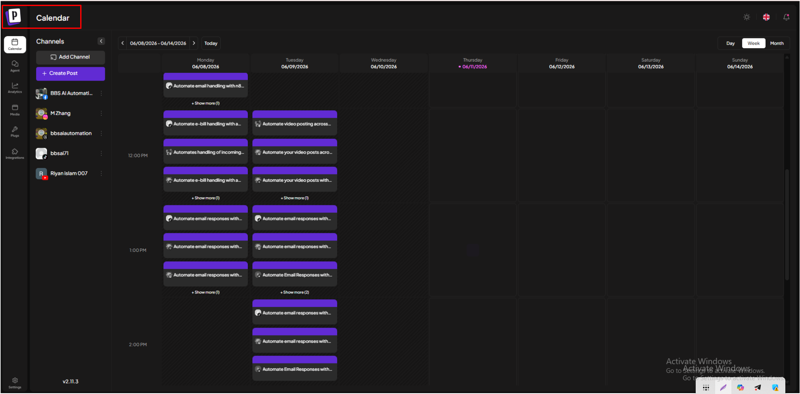
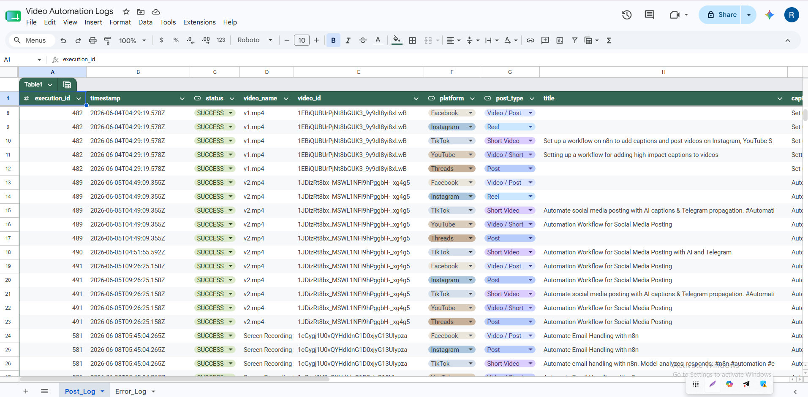
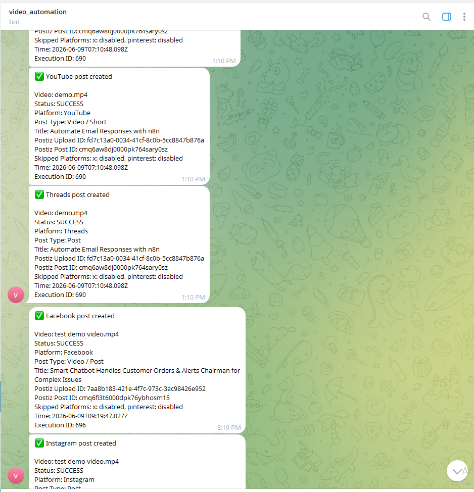

# Self-Hosted Social Media Auto-Posting & Caption Generation Pipeline

A self-hosted AI automation pipeline built with **n8n**, **Ollama**, **qwen2.5vl:7b**, **Whisper AI**, **Postiz**, **Google Drive**, **Google Sheets**, and **Telegram**.

This workflow automatically detects new video uploads, generates platform-specific captions/titles/descriptions/hashtags, posts the content to multiple social media platforms through Postiz, logs the posting status, and sends Telegram notifications.

## Project Overview

This project was built to automate the social media content publishing process for creators, agencies, and businesses.

Instead of manually writing captions, creating platform-specific descriptions, uploading videos, and posting them one by one, this workflow handles the process automatically through a self-hosted pipeline.

The main goal of this project is to reduce manual work, improve posting consistency, and avoid dependency on expensive caption generation or posting automation tools.

## What This Workflow Does

When a new video is uploaded to a specific Google Drive folder, the workflow starts automatically.

The system downloads the video, transcribes it using Whisper AI, analyzes the content using Ollama with the `qwen2.5vl:7b` model, generates platform-specific captions and metadata, uploads the media to Postiz, posts it to selected social platforms, logs the result in Google Sheets, and sends Telegram alerts.

## Key Features

* Google Drive folder trigger
* Automatic new video detection
* Automatic video download
* Whisper AI transcription
* Ollama local AI model integration
* `qwen2.5vl:7b` based caption generation
* Platform-specific title generation
* Platform-specific caption generation
* Platform-specific description generation
* Hashtag generation
* JSON-based structured AI output
* Auto-posting using self-hosted Postiz
* Multi-platform social media posting
* Google Sheets posting log
* Telegram success/failure notification
* Posting status tracking
* Error logging
* Self-hosted n8n workflow
* Cost-efficient automation setup

## Supported Platforms

* TikTok
* Instagram Reels
* YouTube Long Videos
* YouTube Shorts
* Facebook Personal
* Facebook Business Page
* Threads
* X/Twitter
* Pinterest

## Problem It Solves

Content creators and businesses usually need to manually:

* Upload videos to different platforms
* Write captions for each platform
* Create titles and descriptions
* Generate relevant hashtags
* Format content differently for each platform
* Track posting status
* Notify the client/team
* Retry or debug failed posts

This workflow automates these repetitive tasks and makes the social media publishing process faster, more consistent, and easier to manage.

## Why This Project Is Valuable

Many social media automation tools require paid subscriptions or external AI APIs.

This project was designed to reduce that dependency by using:

* Self-hosted n8n
* Self-hosted Postiz
* Local Ollama AI model
* Whisper AI transcription
* Google Sheets for logging
* Telegram for notifications

This makes the workflow more cost-efficient and suitable for clients who want automation without relying heavily on expensive SaaS tools.

## Workflow Process

1. A new video is uploaded to a specific Google Drive folder.
2. n8n detects the new video automatically.
3. The workflow checks whether the uploaded file is a video.
4. The video is downloaded.
5. Whisper AI transcribes the video.
6. A visual/content analysis step extracts useful context.
7. Ollama with `qwen2.5vl:7b` generates platform-specific content.
8. The workflow creates:

   * Title
   * Caption
   * Description
   * Hashtags
9. The AI output is validated and formatted as JSON.
10. The video is uploaded to Postiz.
11. Postiz creates posts for selected social platforms.
12. Google Sheets logs platform, status, timestamp, title, caption, and errors.
13. Telegram sends success or failure notifications.
14. Failed posts can be tracked from the log and retried if needed.

## Architecture

```text
Google Drive Video Upload
        ↓
n8n Trigger
        ↓
Video Type Check
        ↓
Video Download
        ↓
Whisper AI Transcription
        ↓
Visual / Content Summary
        ↓
Ollama + qwen2.5vl:7b
        ↓
Caption, Title, Description & Hashtag Generation
        ↓
Caption Validation
        ↓
Postiz Upload
        ↓
Multi-Platform Auto Posting
        ↓
Google Sheets Logging
        ↓
Telegram Notification
```

## Tech Stack

* n8n
* Ollama
* qwen2.5vl:7b
* Whisper AI
* Postiz
* Google Drive
* Google Sheets
* Telegram Bot
* Docker / Self-hosted environment
* Social Media Automation

## Demo

Loom Demo: https://www.loom.com/share/956977b0036746a0b78fa18598adc226

## Screenshots








## Folder Structure

```text
zero-cost-video-automation-pipeline/
│
├── assets/
│   ├── Heyrock Social platform posting.png
│   ├── Self_Hosted_Postiz.png
│   ├── sheet_Updates.png
│   └── Telegram_notifications.png
│
├── workflow/
│   └── heyrock social platform posting .json
│
├── README.md
└── .gitignore
```

## How to Use

1. Download or clone this repository.
2. Import the workflow JSON file into n8n.
3. Configure your own Google Drive credentials.
4. Configure Whisper AI transcription.
5. Configure Ollama and the `qwen2.5vl:7b` model.
6. Configure your own Postiz instance.
7. Add your own social media platform integrations inside Postiz.
8. Configure Google Sheets logging.
9. Configure Telegram bot notification.
10. Upload a test video to the selected Google Drive folder.
11. Check the generated captions and posting logs.
12. Activate the workflow after successful testing.

## Required Configuration

To run this workflow, users need to configure their own:

* Google Drive account
* Google Sheets account
* Telegram bot
* Self-hosted Postiz instance
* Social media platform integrations
* Ollama model
* Whisper transcription service
* n8n credentials

No real credentials are included in this repository.

## Security Note

This repository does not include real API keys, access tokens, webhook URLs, client credentials, social media tokens, private videos, Google Drive folder IDs, Google Sheet IDs, Telegram chat IDs, Postiz tokens, or business data.

All sensitive values have been removed or replaced with placeholders before publishing.

The workflow JSON is provided as a sanitized portfolio/demo version. To use this workflow, users must configure their own credentials inside n8n.

## Status

Completed and tested as a self-hosted social media auto-posting and caption generation pipeline.

## Author

Built by Md. Shahmul Islam

AI Automation Developer | n8n Workflow Builder
